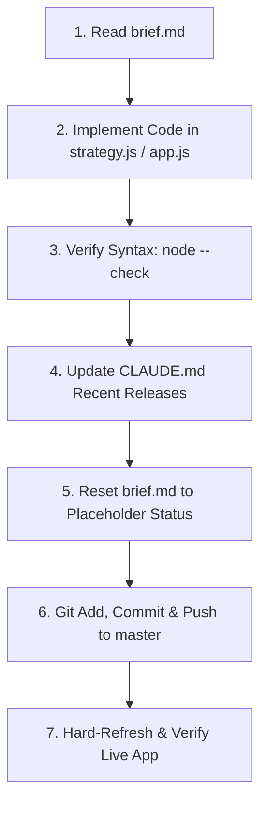

# Rocket Scanner — Operational Architecture & Release Runbook

This document is the single source of truth for the architecture, trading rules, and operational workflow of Rocket Scanner. All future AI agents and developers must strictly adhere to this runbook.

---

## 1. Core Architecture: The 3 Gold Pillars

**Evidence limits (read before tuning or citing results).** The saved FIFO report on 4,848 matched trades shows losses held over five calendar days made up ₹218,752.88 of ₹272,922.62 gross losses (80.2%). Winners averaged 3.9 days held, losers 11.8. That is a descriptive association, not a simulated four-day exit, and the script ignores charges despite its "Net P&L" heading. The 31 Aug tape test cited for "+2.2% MFE" reported **−0.523% net holdout return**, and it tested a different tape-ranking model. Nothing here validates the 1.2% near-high entry, the depth trigger, or the +2%/−1.8% exits as profitable. They are configured policy hypotheses, and the app says so in Methodology and the score tooltip.

The system is strictly unbundled into three distinct tiers in [`strategy.js`](strategy.js):

### Tier 1: Universe Selection ("Which")
Filters the 1,600+ NSE stock universe down to clean, liquid momentum candidates:
- **Price Range**: `₹50 <= Price <= ₹5,000` (Strict penny stock floor eliminates low-float liquidity traps).
- **Liquidity Floor**: Traded turnover >= `₹5 Crore` OR 10-day average volume >= `100,000 shares`.
- **Relative Volume**: `RVOL >= 1.5x` time-of-day expected volume.
- **Trend Alignment**: Price must be trading above Day Open (`LTP > Day Open`) and above VWAP.
- **Strict Anti-Averaging Rule**: Any stock currently in open portfolio holdings is strictly blocked from new buy recommendations.

### Tier 2: Real-Time Breakout Trigger ("When")
Confirms real-time momentum before signaling an entry:
- **Micro-Continuation Proximity**: Within `1.2%` of Day High (`(Day High - LTP) / LTP <= 1.2%`).
- **Circuit Headroom**: Upper circuit ceiling must be at least `3.0%` away (`(Upper Circuit - LTP) / LTP >= 3.0%`).
- **Order Book Confirmation**: Total Buyer Depth > Total Seller Depth (`Total Bid Qty > Total Ask Qty`).
- **Missing data never qualifies**: absent price, liquidity, RVOL, open, VWAP, day high, upper circuit or two-sided depth totals fail the check (v1389).
- **Live-evidence gate**: GO requires a fresh market tick, a fresh per-stock tick and fresh depth totals, all timestamped after the last stream break. Disconnects, stale prices, refreshes and reopened tabs drop GO to WAIT, clear basket selections and disable export until fresh evidence arrives.
- **Trigger Status**: Stocks meeting all conditions fire **`GO`** immediately. Stocks meeting Tier 1 but tracking towards the high display **`WAIT`**. Illiquid/penny/held stocks are marked **`BLOCKED`**.

### Tier 3: Automated Broker Protection & Exit Governor ("Exit")
Enforces strict asymmetric risk management at the broker level and in the UI:
- **Automated Basket GTT**: Every exported CNC Buy Basket order carries automated Zerodha GTT parameters:
  - **Profit Target: `+2.0%`**
  - **Stop-Loss: `-1.8%`**
- **Open Positions Exit Governor**: Monitors open positions every tick and flags immediate action:
  - `🚨 EXIT: TARGET` (+2.0% reached)
  - `🚨 EXIT: STOP_LOSS` (-1.8% reached)
  - `🚨 EXIT: TIME_STOP` (4 trading days since the oldest remaining FIFO lot, without hitting target)
  - Exit advice is withheld (WAIT) when the holding's live quote is stale.
- **Allocation**: GO stocks ranked by strategy score, funded in whole shares within Capital and Max Alloc with buy charges reserved; each funded scrip must reach ₹5,000 notional or it stays unfunded (the floor never shrinks with low capital).

---

## 2. Mandatory Release & Implementation Workflow

Every AI agent and developer **must follow this exact 7-step sequence** without skipping steps:

1. **Check `brief.md`**: Read `brief.md` for active instructions. If `brief.md` is in placeholder status, do not invent unrequested tasks; ask the user or await instructions.
2. **Implement Core Logic**: Make surgical, clean edits to [`strategy.js`](strategy.js) and [`app.js`](app.js). Do NOT add multi-layered speculative statistical models (e.g. median path templates, widening tick intervals) that freeze the scanner or block execution.
3. **Syntax & Verification**:
   - Run `node --check app.js`
   - Run `node --check strategy.js`
   - Run `node --check dev/server.js` (if modified)
4. **Update `CLAUDE.md`**: Record the new version number, what was fixed/added, and why.
5. **Reset `brief.md`**: **Immediately reset `brief.md` back to placeholder status** (`# Active Task: None / Awaiting Next Instruction`) so future agents do not re-execute stale tasks.
6. **Deploy**:
   - `git add <files>`
   - `git commit -m "vXXXX: description"`
   - `git push origin master`
7. **Verify Live**: Remind user to hard-refresh (`Ctrl + F5` or `Cmd + Shift + R`) on `https://axionaut.github.io/rocket-scanner/`.

---

## 3. Critical System Invariants (DO NOT VIOLATE)

1. **No Over-Engineering**: Do not re-introduce multi-sample websocket trend checks (e.g. `diff > prior.diff` across rungs) that block the entire universe from qualifying.
2. **No Averaging Down**: Never recommend or allocate to a ticker that is already in `HOLDINGS`.
3. **Always Include Stop-Loss**: Every basket order must export with `stoploss: -1.8` and `target: 2.0` in `params.gtt`.
4. **Archived History**: Historical changelogs from v1 to v1385 are preserved in [`docs/CHANGELOG_ARCHIVE.md`](docs/CHANGELOG_ARCHIVE.md). Do not re-inflate `CLAUDE.md` with hundreds of pages of obsolete debug logs.

---

## 4. Release History

### v1389 (Current Production)
- **One recommendation table, one Show/Hide Ineligible button**: removed the duplicate model-comparison table and the duplicate toggle; the existing button now works.
- **Unified strategy decisions**: table rows, header counts, GO/WAIT/BLOCKED pills, funding, basket selection and export all read the same `getRowActionState` / `RocketStrategy.evaluateUniverse` result. Old per-row targets/stops were replaced with fixed +2%/−1.8%, and legacy filter overrides no longer apply (saved preferences are left untouched).
- **Missing-data fix**: v1388 let absent liquidity, RVOL, VWAP, circuit or depth data pass. They now fail.
- **Stream-break safety restored**: the v1388 rewrite bypassed freshness checks. Disconnects now invalidate live evidence immediately, and recovery needs new per-stock ticks and depth, not just a `connected` flag.
- **Budget fixes**: charge-aware funding; the ₹5,000 minimum no longer shrinks below capital; unfunded GO rows are not selected.
- **Time stop**: counts trading days from the oldest remaining lot, not a weighted calendar-day age.
- **Evidence honesty**: Methodology, tooltips and §1 now state that thresholds are unvalidated policy. The cited backtest was −0.523% net on holdout, not a +2.2% edge.
- **Verified**: `node --check`, 42 boundary/stream/budget/exit checks (`dev/strategy-reconciliation-check.cjs`, local), and an isolated Playwright run covering one table and toggle, funded selection, disconnect/recovery and all tabs with zero page errors.

### v1388
- **Version Bump & Full Release**: Upgraded release to v1388.
- **3-Tier Strategy Engine Deployed**: Replaced dual-model tick/median split with clean `RocketStrategy` engine in [`strategy.js`](strategy.js).
- **Table Overhaul**: Main table columns updated to `Strategy Score` and `Trigger Status`. Cell displays `⚡ 80+ GO`, `WAIT`, or `—`.
- **Automated Basket GTT**: Buy Basket exports attach `-1.8%` Stop-Loss and `+2.0%` Target GTT directly to Zerodha CNC orders.
- **Exit Governor**: Open holdings table monitors `+2.0%` Target, `-1.8%` SL, and `4-Day` Time Stop.
- **Unblocked Universe**: Removed paralysis checks (`depthQualificationIssue` multi-timestamp widening requirements).
- **Runbook Cleaned & Reset**: `CLAUDE.md` converted to permanent operational runbook; `brief.md` reset to placeholder status.

### v1387
- Initial strategy module extraction and holding duration discovery.

### v1386
- Removed inverted 50% market-wide breadth gate after backtest proved it eliminated sessions with the largest number of upper-circuit runners.

