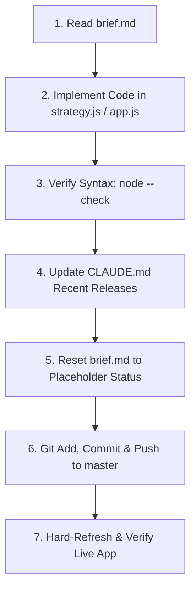

# Rocket Scanner — Operational Architecture & Release Runbook

This document is the single source of truth for the architecture, trading rules, and operational workflow of Rocket Scanner. All future AI agents and developers must strictly adhere to this runbook.

---

## 1. Core Architecture: The 3 Gold Pillars

Based on the empirical analysis of 4,848 completed trades across 11 months, the scanner's historical profitability was driven by early momentum discovery (+2.2% average MFE), while 80.2% of all gross losses were caused by holding positions past 5 days and averaging down into losing trades.

The system is strictly unbundled into three distinct tiers in [`strategy.js`](strategy.js):

### Tier 1: Universe Selection ("Which")
Filters the 1,600+ NSE stock universe down to clean, liquid momentum candidates:
- **Price Range**: `₹50 <= Price <= ₹5,000` (Strict penny stock floor eliminates low-float liquidity traps).
- **Liquidity Floor**: Traded turnover >= `₹5 Crore` OR 10-day average volume >= `100,000 shares`.
- **Relative Volume**: `RVOL >= 1.5x` time-of-day expected volume.
- **Trend Alignment**: Price must be trading above Day Open (`LTP > Day Open`) and above VWAP.
- **Strict Anti-Averaging Rule**: Any stock currently in open portfolio holdings is strictly blocked from new buy recommendations.

### Tier 2: Real-Time Breakout Trigger ("When")
Confirms real-time momentum before signaling an entry:
- **Micro-Continuation Proximity**: Within `1.2%` of Day High (`(Day High - LTP) / LTP <= 1.2%`).
- **Circuit Headroom**: Upper circuit ceiling must be at least `3.0%` away (`(Upper Circuit - LTP) / LTP >= 3.0%`).
- **Order Book Confirmation**: Total Buyer Depth > Total Seller Depth (`Total Bid Qty > Total Ask Qty`).
- **Trigger Status**: Stocks meeting all conditions fire **`GO`** immediately. Stocks meeting Tier 1 but tracking towards the high display **`WAIT`**. Illiquid/penny/held stocks are marked **`BLOCKED`**.

### Tier 3: Automated Broker Protection & Exit Governor ("Exit")
Enforces strict asymmetric risk management at the broker level and in the UI:
- **Automated Basket GTT**: Every exported CNC Buy Basket order carries automated Zerodha GTT parameters:
  - **Profit Target: `+2.0%`**
  - **Stop-Loss: `-1.8%`**
- **Open Positions Exit Governor**: Monitors open positions every tick and flags immediate action:
  - `🚨 EXIT: TARGET` (+2.0% reached)
  - `🚨 EXIT: STOP_LOSS` (-1.8% reached)
  - `🚨 EXIT: TIME_STOP` (4 days held without hitting target — cuts off 80.2% of historical losses)

---

## 2. Mandatory Release & Implementation Workflow

Every AI agent and developer **must follow this exact 7-step sequence** without skipping steps:

1. **Check `brief.md`**: Read `brief.md` for active instructions. If `brief.md` is in placeholder status, do not invent unrequested tasks; ask the user or await instructions.
2. **Implement Core Logic**: Make surgical, clean edits to [`strategy.js`](strategy.js) and [`app.js`](app.js). Do NOT add multi-layered speculative statistical models (e.g. median path templates, widening tick intervals) that freeze the scanner or block execution.
3. **Syntax & Verification**:
   - Run `node --check app.js`
   - Run `node --check strategy.js`
   - Run `node --check dev/server.js` (if modified)
4. **Update `CLAUDE.md`**: Record the new version number, what was fixed/added, and why.
5. **Reset `brief.md`**: **Immediately reset `brief.md` back to placeholder status** (`# Active Task: None / Awaiting Next Instruction`) so future agents do not re-execute stale tasks.
6. **Deploy**:
   - `git add <files>`
   - `git commit -m "vXXXX: description"`
   - `git push origin master`
7. **Verify Live**: Remind user to hard-refresh (`Ctrl + F5` or `Cmd + Shift + R`) on `https://axionaut.github.io/rocket-scanner/`.

---

## 3. Critical System Invariants (DO NOT VIOLATE)

1. **No Over-Engineering**: Do not re-introduce multi-sample websocket trend checks (e.g. `diff > prior.diff` across rungs) that block the entire universe from qualifying.
2. **No Averaging Down**: Never recommend or allocate to a ticker that is already in `HOLDINGS`.
3. **Always Include Stop-Loss**: Every basket order must export with `stoploss: -1.8` and `target: 2.0` in `params.gtt`.
4. **Archived History**: Historical changelogs from v1 to v1385 are preserved in [`docs/CHANGELOG_ARCHIVE.md`](docs/CHANGELOG_ARCHIVE.md). Do not re-inflate `CLAUDE.md` with hundreds of pages of obsolete debug logs.

---

## 4. Release History

### v1388 (Current Production)
- **Version Bump & Full Release**: Upgraded release to v1388.
- **3-Tier Strategy Engine Deployed**: Replaced dual-model tick/median split with clean `RocketStrategy` engine in [`strategy.js`](strategy.js).
- **Table Overhaul**: Main table columns updated to `Strategy Score` and `Trigger Status`. Cell displays `⚡ 80+ GO`, `WAIT`, or `—`.
- **Automated Basket GTT**: Buy Basket exports attach `-1.8%` Stop-Loss and `+2.0%` Target GTT directly to Zerodha CNC orders.
- **Exit Governor**: Open holdings table monitors `+2.0%` Target, `-1.8%` SL, and `4-Day` Time Stop.
- **Unblocked Universe**: Removed paralysis checks (`depthQualificationIssue` multi-timestamp widening requirements).
- **Runbook Cleaned & Reset**: `CLAUDE.md` converted to permanent operational runbook; `brief.md` reset to placeholder status.

### v1387
- Initial strategy module extraction and holding duration discovery.

### v1386
- Removed inverted 50% market-wide breadth gate after backtest proved it eliminated sessions with the largest number of upper-circuit runners.

